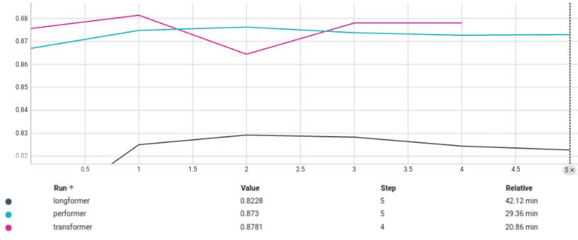

# Varformers: Benchmarking Efficient Transformer Variants

## Table of Contents

- [Varformers: Benchmarking Efficient Transformer Variants](#varformers-benchmarking-efficient-transformer-variants)
  - [Table of Contents](#table-of-contents)
  - [Overview](#overview)
  - [Dataset](#dataset)
  - [Model Variants](#model-variants)
    - [Transformer](#transformer)
    - [Performer](#performer)
    - [Longformer](#longformer)
  - [Training Information](#training-information)
  - [Results and Comparison](#results-and-comparison)
    - [Validation Loss](#validation-loss)
    - [Validation Accuracy](#validation-accuracy)
  - [Usage](#usage)
  - [Contribution](#contribution)
  - [Citations](#citations)

## Overview

This repository contains the implementation of two Transformer variants (Performer and Longformer) along with the base Transformer. These are more memory efficient variations proposed after the Transformer particularly when we have to deal with longer sequences. We have also compared their performance on a classification task. Specifically, we have focused on sentiment classification using only the encoder portion of the Transformer model, since the decoder is not needed for this task. The base transformer model is derived from the Annotated Transformer tutorial, and the two variants—Performer and Longformer—are implemented by modifying just the self-attention mechanism. The focus is on enhancing performance (both in terms of time and memory), and comparing the efficacy of these models on a sentiment classification dataset.

## Dataset

The dataset used in this project consists of fashion product reviews, which was downloaded from [Amazon Reviews 2023](https://amazon-reviews-2023.github.io/). The dataset was labeled for binary sentiment classification as:
- **Positive (1)**: Ratings of 4 or 5.
- **Negative (0)**: Ratings of 1, 2, or 3.

A total of 120,000 samples were randomly selected, divided into training (80k), testing (20k), and validation (20k) subsets.

## Model Variants

### Transformer
This is a base Transformer architecture as described in the [Attention Is All You Need](https://arxiv.org/pdf/1706.03762) paper. In a typical Transformer, the model consists of an encoder-decoder structure. However, for a classification, we usually require just the encoder followed by Feed Forward Network using a classification head. For Transformer implementation, we will refer to [The Annotated Transformer](https://nlp.seas.harvard.edu/annotated-transformer/) tutorial which walks through the entire process of implementing the Transformer model from scratch using PyTorch providing extensive annotations and explanations for each part of the model.


### Performer
The Performer addresses the quadratic complexity by introducing an efficient attention mechanism called FAVOR+ (Fast Attention Via Orthogonal Random features). It approximates the traditional softmax-based self-attention with linear complexity O(N) as shown in the image below. Instead of directly computing the dot product between all pairs of tokens, FAVOR+ uses kernel-based methods to project the input into a lower-dimensional space where interactions can be computed more efficiently. Performer utilizes random feature maps to approximate the softmax function. This technique enables it to compute attention using a linear number of operations relative to the sequence length, significantly reducing the memory footprint and computational cost.


### Longformer
The Longformer modifies the Transformer architecture to handle long sequences effectively. Longformer introduces a sliding window attention mechanism, where each token attends to a fixed number of neighboring tokens within a sliding window, reducing the complexity from O(N^2) to O(N). Additionally, it incorporates dilated (or strided) attention, which allows tokens to attend to other tokens at regular intervals outside their immediate neighborhood, capturing broader context while still being efficient. For tasks requiring some tokens to attend globally across the entire sequence (e.g., classification tokens, question tokens in QA tasks), Longformer allows certain tokens to attend to all tokens in the sequence (global attention), while most tokens continue using the local sliding window attention. This hybrid approach balances efficiency with the ability to capture long-range dependencies when needed. As shown in the image below, all the tokens (along the diagonal) attend to their neighbouring tokens along with all the global tokens (for example CLS), and the global tokens attend all the tokens in the sequence. 


## Training Information

The table below provides a summary of the common key training parameters used to train these Transformer variants.

| Hyperparameter           | Value      |
|--------------------------|------------|
| Number of Encoder Layers | 6          |
| Number of Heads          | 8          |
| Embedding Dimension      | 128        |
| Dropout                  | 0.1        |
| Optimizer                | Adam       |
| Learning Rate            | 0.0001     |
| Early Stopping           | True       |
| Batch Size               | 16         |

## Results and Comparison

To evaluate the training performance of the three Transformer variants - Transformer, Performer, and Longformer, their validation loss and validation accuracy was compared on the validation dataset (against number of epochs). Here's a pictorial summary of the findings:

### Validation Loss


### Validation Accuracy


The models were primarily assessed using accuracy metric since it was trained on a balanced dataset. 

## Usage

The code was tested using Python 3.9.18 and the dependencies can be installed using `pip`. Follow the steps to use this implementation:

1. Clone the repository:
   ```bash
   git clone https://github.com/infocusp/varformers.git
   ```
2. Install the required packages:
   ```bash
   pip install -r requirements.txt
   ```
3. Update the `config.yml` accordingly to use the correct datapath, to use a particular model variant, and to configure the model parameters like number of encoder layers, number of heads in an encoder layer, etc.
   
4. Run the training script from the root directory:
   ```bash
   python3 train.py
   ```


## Contribution

Contributions are welcome! Please fork this repository and submit a pull request for any enhancements or bug fixes.

## Citations

- [Attention Is All You Need](https://arxiv.org/abs/1706.03762): Transformer Paper
- [Rethinking Attention with Performers](https://arxiv.org/abs/2009.14794): Performer Paper
- [Longformer: The Long-Document Transformer](https://arxiv.org/abs/2004.05150): Longformer Paper
- [Annotated Transformer](https://nlp.seas.harvard.edu/annotated-transformer/): Transformer Implementation
- [Phil Wang](https://github.com/lucidrains/performer-pytorch): Performer Implementation
- [Transformers: State-of-the-Art Natural Language Processing](https://aclanthology.org/2020.emnlp-demos.6): Huggingface implementation of Longformer


